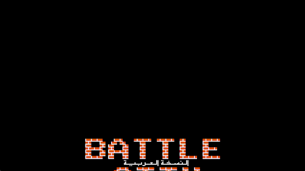

# LovECS

Using LovECS in a practical context.

Remake of BattleCityRemake using lovecs.

To run use LOVE2D launcher extension and place love appimage renamed to "love" in a defined PATH. Then you can use Alt+L to launch

